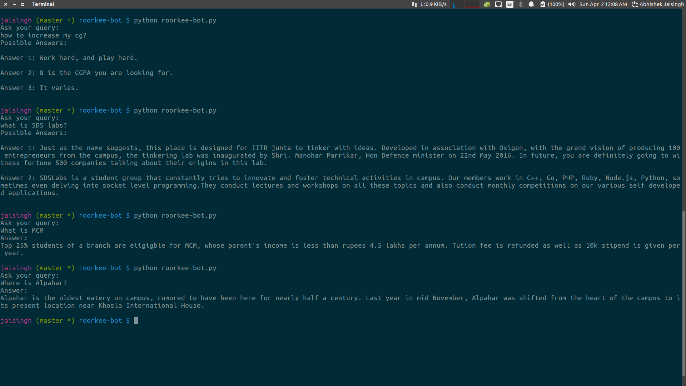

# roorkee-bot
an artificially intelligent bot programmed in python to answer general queries about iit roorkee

# usage
run the following command
```
python roorkee-bot.py
```
bot will display a message when it is ready to answer the question.

input your question when prompted and the bot will magically find the best answer

# screenshots


# requirements
+ python 2.7
+ pyenchant dictionary
```
pip install pyenchant
```
+ nltk
+ sklearn
